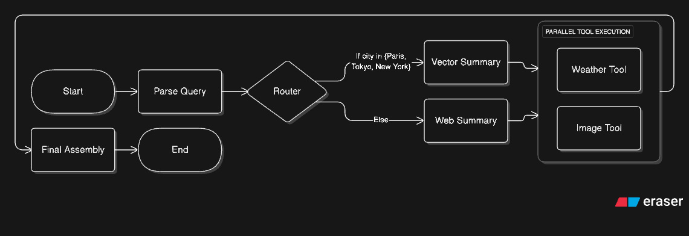

# Multimodal Travel Agent

A LangGraph powered multi-modal travel assistant that aggregates vector based and web based knowledge with live weather and image retrieval into a structured response.

## Architecture Overview
This diagram represents the conceptual LangGraph topology; the actual StateGraph is constructed programmatically in code.


The system is implemented as a LangGraph StateGraph that performs
conditional routing, parallel tool execution, and structured output
assembly for a multi-modal travel assistant.

### LangGraph State Machine

The system is built as a **StateGraph** with 7 nodes orchestrating data retrieval and processing:

```
Entry → Parse → Router → [Vector/Web Summary] → Tools → Final → End
```

**Node Breakdown:**

1. **Parse Query** - Extracts city name and date references using GPT-4o with structured output
2. **Router** - Conditionally routes to vector store or web search based on data availability
3. **Vector Summary** (Paris, Tokyo, New York) - Retrieves pre-ingested city data from ChromaDB
4. **Web Summary** (All other cities) - Uses Tavily API for live web search
5. **Tools** - **Parallel execution** of weather (OpenWeatherMap) and image (Unsplash/Pexels) APIs
6. **Final Assembly** - Validates output, applies fallbacks, formats for UI

### State Management

- **Pydantic TravelState** tracks: `city`, `date_range`, `city_summary`, `weather_forecast`, `image_urls`, `errors`, `conversation_history`
- **Memory Checkpointer** preserves context across queries for intelligent caching
- **Context Preservation**: Detects repeated cities and skips redundant summary/image fetches

### Key Technical Distinctions

#### 1. Manual Tool Transmission 
Custom tool executor that manually parses and invokes weather/image APIs without framework abstractions, demonstrating raw tool calling protocol understanding.

#### 2. Parallel Fan-Out 
- **Graph Level**: Conditional routing ensures mutually exclusive vector or web retrieval based on knowledge availability
- **Tool Level**: `ThreadPoolExecutor` runs weather and image fetching concurrently, reducing latency ~50%

#### 3. Human-in-the-Loop & Time Travel 
- LangGraph checkpointer enables conversation history persistence
- Smart caching: Repeat queries for same city skip summary/images, only update weather
- Date range tracking with API limitation warnings

## Tech Stack

- **Orchestration**: LangGraph (StateGraph, conditional edges, memory)
- **LLMs**: OpenAI GPT-4o (structured extraction, summarization)
- **Vector Store**: ChromaDB + Sentence Transformers (all-MiniLM-L6-v2)
- **APIs**: Tavily (web search), OpenWeatherMap (forecast), Unsplash/Pexels (images)
- **Frontend**: Streamlit with Altair charts
- **Data**: Pydantic schemas, JSON structured output

## Project Structure

```
├── app.py                      # Streamlit UI entrypoint
├── graph/
│   ├── build_graph.py          # LangGraph StateGraph construction
│   ├── state.py                # Pydantic TravelState schema
│   ├── output_schema.py        # Final output format
│   ├── nodes/                  # Graph node implementations
│   │   ├── parse_query.py      # City extraction (structured LLM)
│   │   ├── router.py           # Vector vs. web decision
│   │   ├── city_summary_vector.py
│   │   ├── city_summary_web.py
│   │   ├── tool_executor.py    # Parallel weather + image fetch
│   │   └── final_assembly_node.py
│   └── schemas/
│       └── extraction.py       # CityExtraction Pydantic model
├── tools/
│   ├── weather_api.py          # OpenWeatherMap integration
│   ├── image_api.py            # Unsplash/Pexels image search
│   ├── web_search.py           # Tavily web search
│   └── vector_store.py         # ChromaDB retrieval
├── config/
│   ├── prompts.py              # LLM system prompts
│   └── settings.py             # Environment config
├── storage/
│   └── chroma/                 # Persistent vector store
├── ingestion/
│   └── ingest_cities.py        # Vector DB population script
└── tests/                      # Unit tests for nodes/tools
```

## Running Locally

### Prerequisites
- Python 3.10+
- API Keys: OpenAI, OpenWeatherMap, Tavily, Unsplash or Pexels

### Setup

1. Clone and install dependencies:
```bash
git clone https://github.com/MuaazSM/multimodal-travel-agent.git
cd multimodal-travel-agent
pip install -r requirements.txt
```

2. Create `.env` with your API keys:
```bash
OPENAI_API_KEY=your_key
OPENWEATHER_API_KEY=your_key
TAVILY_API_KEY=your_key
UNSPLASH_API_KEY=your_key
PEXELS_API_KEY=your_key
```

3. Run Streamlit app:
```bash
streamlit run app.py
```

## Running with Docker

```bash
docker build -t multimodal-travel-agent:latest .
docker run --rm -p 8501:8501 --env-file .env multimodal-travel-agent:latest
```

Open `http://localhost:8501`

## Design Decisions

1. **Why Parallel Execution?** Weather and images are independent; fetching concurrently halves API wait time
2. **Why ChromaDB?** Lightweight, persistent, no separate server needed for pre-ingested cities
3. **Why Skip Logic?** Repeated queries waste API calls; context preservation improves UX and reduces cost
4. **Why Streamlit?** Required by spec; clean data visualization with minimal frontend code

## Limitations

- OpenWeatherMap free tier: 5-day forecast only (user queries beyond this show warnings)
- Vector store: Only 3 pre-populated cities (Paris, Tokyo, New York); others use web search
- Image APIs: Rate-limited; fallback gracefully on errors


---

**Author**: Muaaz Shaikh  
**Challenge**: AI Engineering Technical Assessment - Multi-Modal Agentic Workflow by Digital Alpha Platforms
